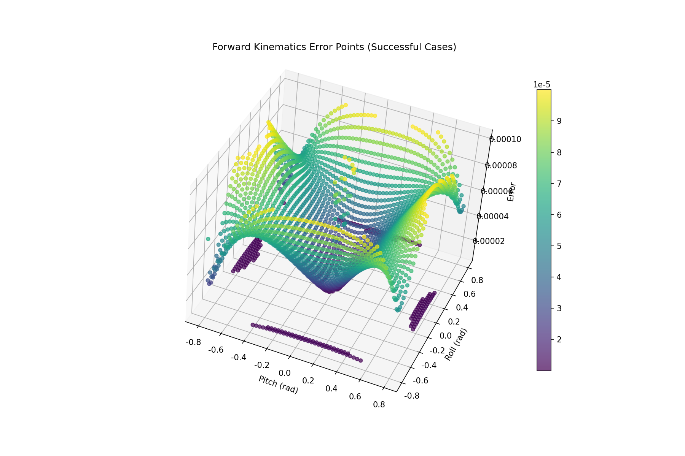

# 1. 概述

> 注意：关于并联杆机构，正向运动学和逆向运动学的定义在不同资料里存在不一致的情况。为避免存在混淆，在这里我们定义逆向运动学是已知关节空间$q_j$（踝关节pitch和roll），求解电机空间$q_m$的过程，正向运动学反之。

参照论文[^1]，编写踝关节的运动学逆解，并基于CasADi计算雅可比，用于正向运动学的迭代求解以及速度映射和扭矩映射。

# 2. 几种重要的变换

## 2.1 逆向运动学

参照论文[^1]方法构造

<p align="center">
    
</p>

如图 (a) 所示，胫骨坐标系 $Σ1$ 作为固定坐标系，其原点位于踝关节万向铰的中心。$Σ3$ 表示位于足部的一个运动坐标系。  
$\theta_{\text{pitch}}$和 $\theta_{\text{roll}}$ 分别表示 $Σ3$ 相对于 $Σ1$ 绕 y 轴和 x 轴的旋转角度。
左侧执行器旋转中心相对于 $Σ1$ 的位置为：

$$
^1p_{la}=[x_{la},y_{la},z_{la}]^T.
$$

$^1p_{lb}$ 表示球窝关节相对于 $Σ1$ 的位置。$^3p_{lu}$ 表示左脚跟万向铰相对于 $Σ3$ 的位置。于是，脚跟万向铰在 Σ1 中的位置 $^1p_{lu}$ 可表示如下。
$$
^1p_{lu}=[x_{lu},y_{lu},z_{lu}]'=R_{y}(\theta_{pitch})R_{x}(\theta_{roll})^3p_{lu}
$$
如图 (b) 所示，将点 $^{1}p_{la}$ 和 $^{1}p_{lu}$ 投影到 y–z 平面上，两点之间的距离记为 $d_{ly}$。
$$
d_{ly}=y_{la}-y_{lu}
$$
如图 (c) 所示，将点 $^{1}p_{lb}$ 和 $^{1}p_{lu}$ 投影到 x–z 平面上，两点之间的距离记为 $l_{xz}$。
$$
l_{xz}=\sqrt{ l^2-d_{ly}^2 }
$$
为方便计算，定义以下几个变量。
$$
\alpha=\tan^{-1}\left( \frac{\Delta x}{\Delta z} \right),\ \beta=\cos^{-1}\left( \frac{\Delta l^2+r^2-l_{xz}^2}{2r\Delta l} \right)
$$
$$
\begin{array}{ll}
\Delta x=x_{la}-x_{lu}, \\
\Delta z=z_{la}-z_{lu}, \\
\Delta l=\sqrt{ \Delta x^2+\Delta z^2 }.
\end{array}
$$
左侧关节电机的角度为：
$$
\phi_{l}=\alpha+\beta-\frac{\pi}{2}
$$
类似的，我们也可以计算得到右侧电机的角度。

## 2.2 正向运动学

由于正向运动学无法获得解析解，因此我们需要基于逆向运动学方程，使用CasADi计算其雅可比矩阵$J$，再基于$J$使用迭代方法求解正向运动学问题。

### **算法流程**

目的：给定电机角度 $q_m = [\phi_l, \phi_r]^T$，求解关节角度 $q_j = [pitch, roll]^T$。

1. **初始化**：

   - 初始关节角度：$q_j^{(0)} = q_{j0}$（初值）
   - 步长因子：$\alpha = 0.9$
   - 收敛阈值：$\epsilon = 10^{-4}$
   - 最大迭代次数：$N_{max} = 100$
2. **迭代过程**：

```
for k = 0, 1, 2, ..., N_max:
// 计算当前电机角度
q_m^{(k)} = IK(q_j^{(k)})  // 逆运动学

// 计算误差
Δq_m = q_m - q_m^{(k)}

// 收敛检查
if ||Δq_m|| < ε: break

// 计算雅可比矩阵
J = ∂q_m/∂q_j |_{q_j^{(k)}}

// 牛顿-拉夫逊更新
q_j^{(k+1)} = q_j^{(k)} + α · J^{-1} · Δq_m
```

3. **雅可比矩阵计算**：

$$
J = \frac{\partial q_m}{\partial q_j} = \begin{bmatrix}
\frac{\partial \phi_l}{\partial pitch} & \frac{\partial \phi_l}{\partial roll} \\
\frac{\partial \phi_r}{\partial pitch} & \frac{\partial \phi_r}{\partial roll}
\end{bmatrix}
$$

使用CasADi符号微分自动计算
4. **矩阵求逆优化**：
对于2×2雅可比矩阵，使用解析公式求逆：

$$
J^{-1} = \frac{1}{\det(J)} \begin{bmatrix}
J_{22} & -J_{12} \\
-J_{21} & J_{11}
\end{bmatrix}
$$

其中 $\det(J) = J_{11}J_{22} - J_{12}J_{21}$

### **算法特点**

- 收敛速度快（通常5-10次迭代）
- 数值稳定性好（雅可比矩阵条件数良好）
- 奇异性处理（检测行列式近零情况）
- 最优性能（专用2×2矩阵求逆，比通用方法快3-5倍）

## 2.3 逆向速度映射

关节空间速度$v_{j}$到电机空间速度$v_{m}$：

$$
\begin{array}{ll}
v_m&=J(q_j)v_j
\end{array}
$$

## 2.4 正向速度映射

电机空间速度$v_{m}$到关节空间速度$v_{j}$：

$$
v_j=J(q_j)^{-1}v_m
$$

## 2.5 逆向扭矩映射(未在仿真验证)

$$
\tau_{m}=J(q_{j})^{-T}\tau_{j}
$$

## 2.6 正向扭矩映射(未在仿真验证)

$$
\tau_{j}=J(q_{j})^{T}\tau_{m}
$$

# 代码实现

参见[这里](https://github.com/Matthew-WangT/algorithm-collection/blob/main/geometry/ankle_solver/ankle_solver.py)

- 正解误差：这里pitch和roll迭代初值都为0，如果使用前一帧作为初值，那么精度会相当高：

<p align="center">
    
</p>
- 误差与迭代次数的平面图：
<p align="center">
    
</p>

[^1]: W.-S. Jang, D.-Y. Kim, Y.-S. Choi, and Y.-J. Kim, “Self-Contained 2-DOF Ankle-Foot Prosthesis With Low-Inertia Extremity for Agile Walking on Uneven Terrain,” IEEE Robotics and Automation Letters, vol. 6, no. 4, pp. 8134–8141, Oct. 2021, doi: 10.1109/LRA.2021.3098931.
