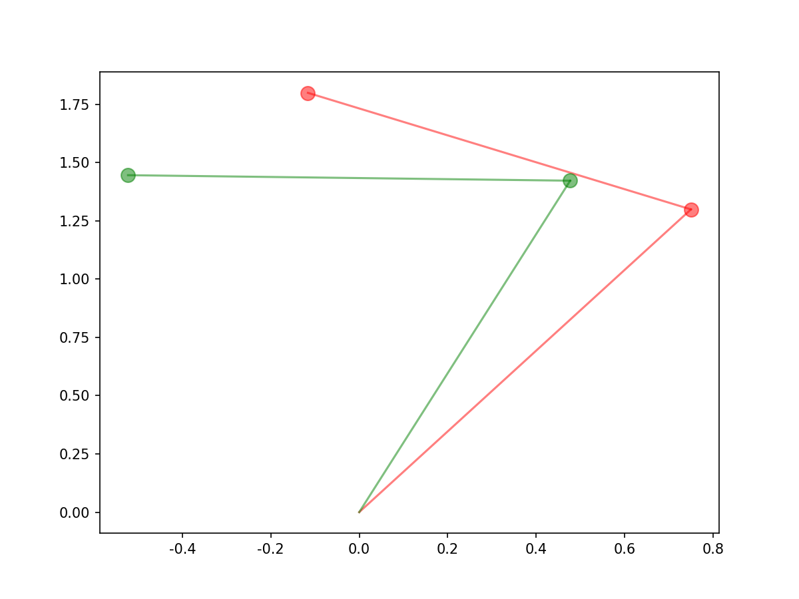
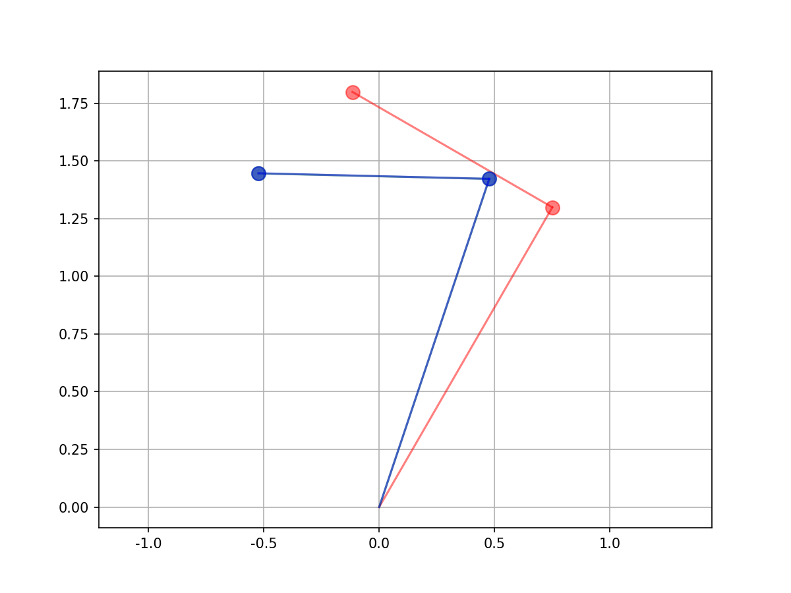
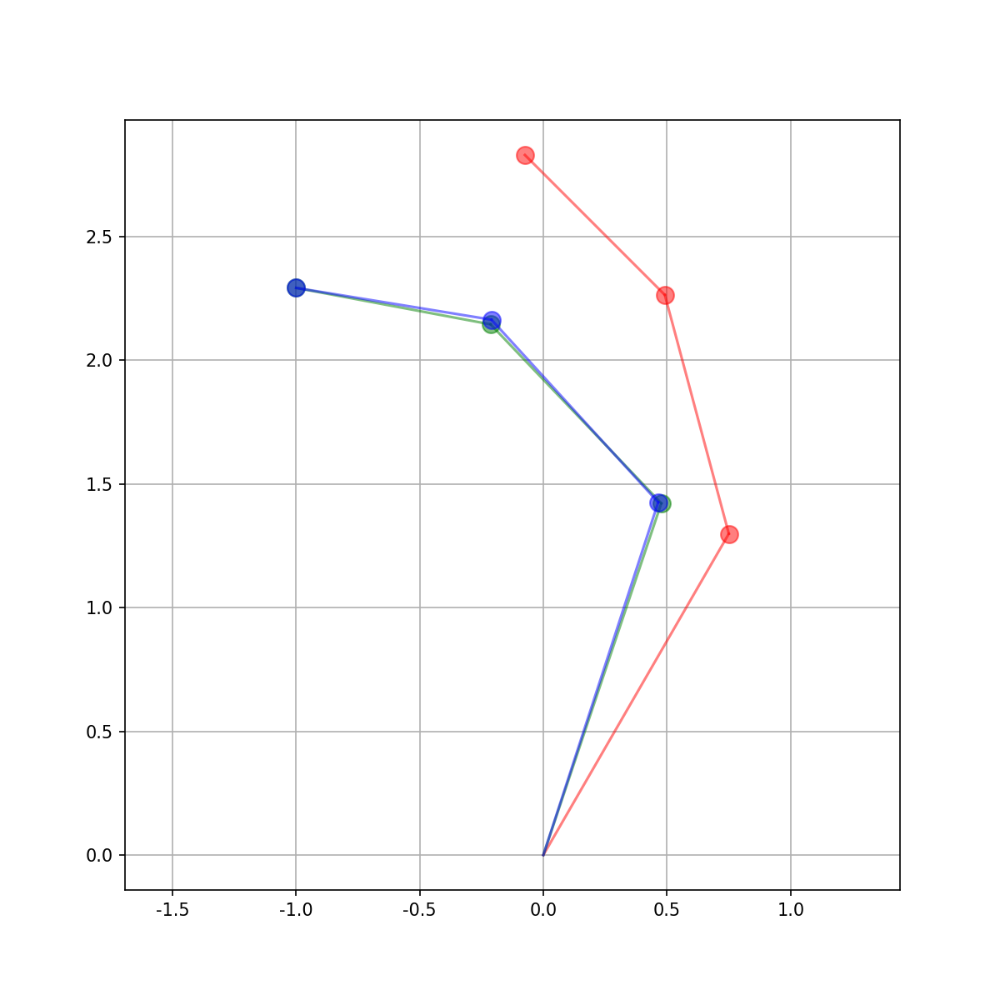
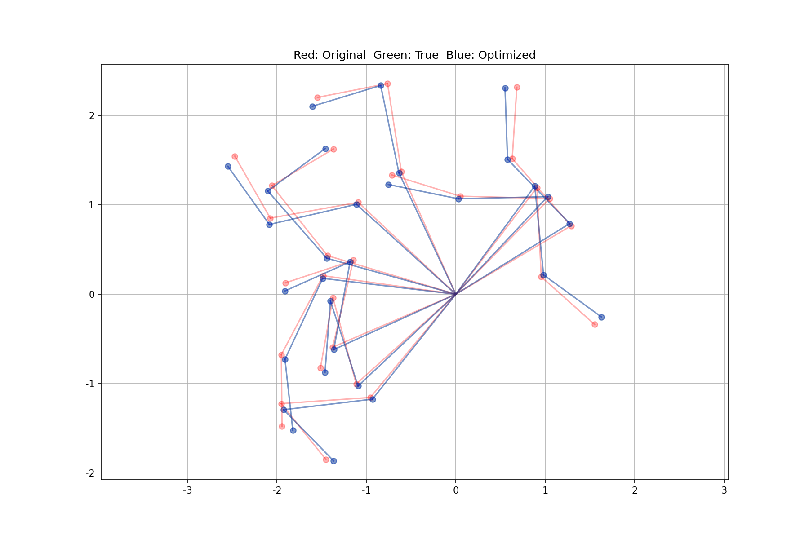
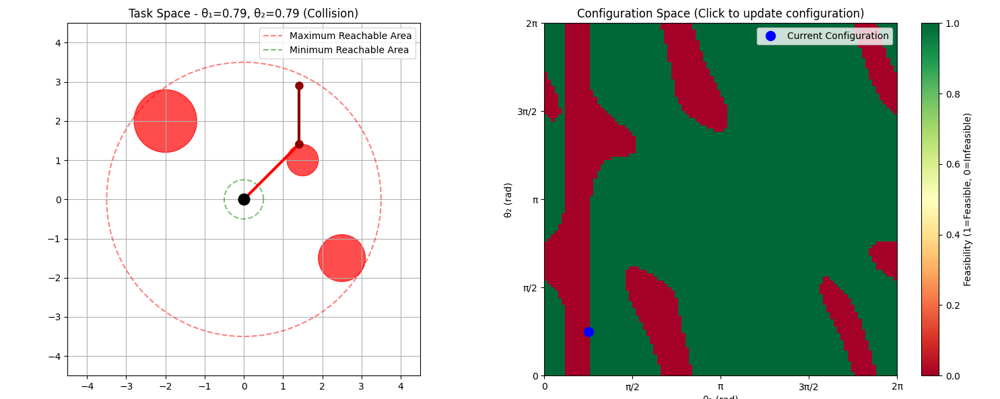

# Algorithm Collection

This repository contains a collection of algorithms and data structures implemented in various programming languages. Maybe you'll find them useful.

# List
## geometry
### sat.py
- *Summary*: 分离轴定理（SAT）是一种用于检测两个凸多边形是否相交的算法。它的原理是，如果两个凸多边形不相交，那么一定存在至少一个轴，使得这两个多边形在该轴上的正交投影不重叠。SAT算法通过检查所有可能的分离轴来确定两个多边形是否相交。这些分离轴通常是多边形边的法线。

<p align="center">
    
</p>

### reflection_matrix_coordinate_conversion.py
- *Summary*: 坐标系转换与轴角表示可视化工具。该程序演示了左手坐标系与右手坐标系之间的转换，以及旋转矩阵的轴角表示。
- 主要功能：
  - **欧拉角转旋转矩阵**: 将ZYX欧拉角转换为旋转矩阵（左手坐标系）
  - **旋转矩阵转轴角**: 将旋转矩阵转换为轴角表示（轴向量+旋转角度）
  - **坐标系转换**: 通过反射矩阵实现左手坐标系到右手坐标系的转换
  - **3D可视化**: 同时显示两个坐标系的旋转轴和角度
- 核心算法：
  - 使用变换矩阵 `T = [[1,0,0], [0,1,0], [0,0,-1]]` 进行手性转换
  - 轴角提取采用Rodrigues公式的逆变换
  - 特殊处理角度接近0和π的边界情况
- 应用场景：
  - 机器人学中的坐标系转换
  - 计算机图形学中的旋转表示
  - 姿态估计和控制系统
- 示例输出：
  ```
  Left-hand system:  axis=[0.236, 0.409, 0.881], angle=66.45°
  Right-hand system: axis=[-0.236, -0.409, 0.881], angle=66.45°
  ```

## joint zero point cali

### plane arm
#### R2Descent.py
- *Summary*: 2R机器人关节零点标定,使用梯度下降法
- 目的：用最简单的例子验证手臂零点偏差标定可行性
- 手段：casadi计算FK以及雅阁比+梯度下降法迭代求解
- 具体步骤：
	- casadi编写机械臂前向运动学模型
	- casadi计算RR机械臂雅阁比
	- 给出关节角测量值$q=\left[ \frac{\pi}{3}, \frac{\pi}{2} \right]^T$.
	- 设零点偏差真值为$\delta^{*}=[0.2,0.3]^T$.
	- 初始化$\delta=[0,0]^T$.
	- 迭代：
		- $\hat{q}=q+\delta$.
		- $e=FK(\hat{q})-FK(q+\delta^*)$.
		- 如果$\mid\mid e\mid\mid^2\le \epsilon$，退出迭代
		- $\delta=\delta-0.1*J^Te$.
效果：
- 红色为观测值，绿色为真值，蓝色为估计值：
<p align="center">
    
    
</p>

- 求解结果如下，可见已经非常接近：
<p align="center">
    
</p>

- 优缺点：
	 - Pros:  实现简单，直接用梯度下降法
	 - Cons: 只使用一次测量，可能存在误差

#### R3LM.py
- *Summary*: 3R机器人关节零点标定,使用LM算法
- 与RR方法类似，不过迭代过程使用LM方法，可以得到以下结果：
```bash
iter 80: error: 0.000235, q_hat: [1.25593, 1.05488, 0.669344]
iter 81: error: 0.000212, q_hat: [1.25594, 1.05488, 0.669343]
iter 82: error: 0.000190, q_hat: [1.25594, 1.05488, 0.669343]
iter 83: error: 0.000171, q_hat: [1.25595, 1.05488, 0.669343]
iter 84: error: 0.000154, q_hat: [1.25596, 1.05488, 0.669343]
iter 85: error: 0.000139, q_hat: [1.25596, 1.05488, 0.669343]
iter 86: error: 0.000125, q_hat: [1.25596, 1.05489, 0.669343]
iter 87: error: 0.000112, q_hat: [1.25597, 1.05489, 0.669343]
iter 88: error: 0.000101, q_hat: [1.25597, 1.05489, 0.669343]
Converged!
q bias:  [0.208774, 0.269489, 0.145744]
```
- 可视化为
<p align="center">
    
</p>

- 可见标定值与真值存在差异，对于RRR机械臂而言，一次测量并不能标定出正确的零点.

#### R3Nlopt.py
- *Summary*: 3R机器人关节零点标定,使用nlopt优化
- 为方便拓展，我们使用`nlopt`进行求解：
- 具体步骤：
	- 随机采样N份数据$Q=\{q_{1}.q_{2}.q_{3},\dots\}$.
	- 定义误差为：$e=\sum_{i}||FK(q_{i}+\delta_{i})-FK(q_{i}+\delta^*）||^2$.
	- 梯度为：$\nabla=2J^Te$.
- 配置nlopt各项设置，在这里，我们使用`LD_SLSQP`算法。
- 调用nlopt，求解：
```bash
time cost: 17.52 ms
找到的偏差： [0.02 0.03 0.05]
最终误差： 3.4512664603419266e-31
```
- 可视化：
<p align="center">
    
</p>

### arm
#### arm_joint_cali.py
- *Summary*: 机械臂关节零点标定,使用nlopt优化

#### arm_kinematics.py
- *Summary*: 机械臂运动学求解

## robot config space
### rr_robot_config_space_interactive.py
- *Summary*: 2R机械臂配置空间可视化
<p align="center">
    
</p>
