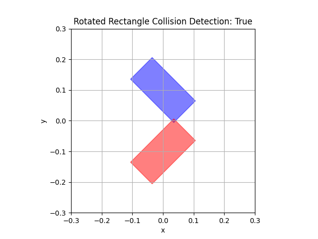

# Algorithm Collection

This repository contains a collection of algorithms and data structures implemented in various programming languages. Maybe you'll find them useful.

# List
## geometry
### sat.py
- *Summary*: 分离轴定理（SAT）是一种用于检测两个凸多边形是否相交的算法。它的原理是，如果两个凸多边形不相交，那么一定存在至少一个轴，使得这两个多边形在该轴上的正交投影不重叠。SAT算法通过检查所有可能的分离轴来确定两个多边形是否相交。这些分离轴通常是多边形边的法线。

    

## joint zero point cali

### plane arm
#### R2Descent.py
- *Summary*: 2R机器人关节零点标定,使用梯度下降法

#### R3LM.py
- *Summary*: 3R机器人关节零点标定,使用LM算法

#### R3Nlopt.py
- *Summary*: 3R机器人关节零点标定,使用nlopt优化

### arm
#### arm_joint_cali.py
- *Summary*: 机械臂关节零点标定,使用nlopt优化

#### arm_kinematics.py
- *Summary*: 机械臂运动学求解
